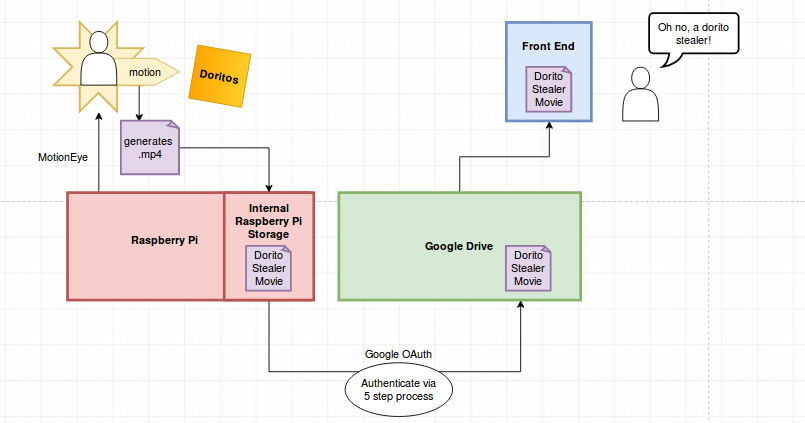
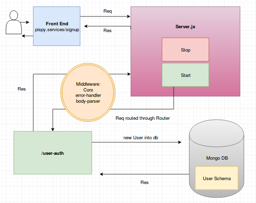
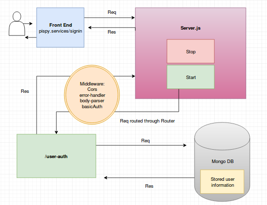

## Table of Content

1. [About The Application](https://github.com/arn1313/pi-spy/blob/master/README.md#about-the-application)
2. [How To Install](https://github.com/arn1313/pi-spy/blob/master/README.md#how-to-install)
3. [How To Use](https://github.com/arn1313/pi-spy/blob/master/README.md#how-to-use)
4. [Necessary Hardware](https://github.com/arn1313/pi-spy/blob/master/README.md#necessary-hardware)
5. [User Sign Up](https://github.com/arn1313/pi-spy/blob/master/README.md#user-sign-up)
6. [User Sign In](https://github.com/arn1313/pi-spy/blob/master/README.md#user-sign-in)
7. [Accessing Surveillance Footage](https://github.com/arn1313/pi-spy/blob/master/README.md#accessing-surveillance-footage)
8. [Deleting Surveillance Footage](https://github.com/arn1313/pi-spy/blob/master/README.md#deleting-surveillance-footage)
9. [Pi Spy Dependencies](https://github.com/arn1313/pi-spy/blob/master/README.md#pi-spy-dependencies)
10. [How To Report Bugs or Issues](https://github.com/arn1313/pi-spy/blob/master/README.md#how-to-report-bugs-or-issues)
11. [Credits And Thanks](https://github.com/arn1313/pi-spy/blob/master/README.md#credits-and-thanks)
12. [Upcoming Features](https://github.com/arn1313/pi-spy/blob/master/README.md#upcoming-features)
13. [FAQs](https://github.com/arn1313/pi-spy/blob/master/README.md#faqs)

## About the Application

Pi Spy is a user-based, motion-activated video security and surveillance system built using Raspberry Pi using MotionEye and Google Drive. Users can create an account, sign in, and either live view or record via a preset USB camera. Files from the camera are stored on a user's Google Drive account.

For required hardware to use application, see the [Necessary Hardware](https://github.com/arn1313/pi-spy/blob/master/README.md#necessary-hardware) section. For required dependencies for use of the Pi Spy project, see the [Pi Spy Dependencies](https://github.com/arn1313/pi-spy/blob/master/README.md#pi-spy-dependencies) section. For all other questions, see the [FAQs](https://github.com/arn1313/pi-spy/blob/master/README.md#faqs) section.

## How To Install

To install the Pi Spy API, either clone the repository and install all package.json dependencies, or fork, clone, and install all dependencies.

In order to use our app, you will also need to configure hardware such as the camera and Raspberry Pi, listed in our [Necessary Hardware](https://github.com/arn1313/pi-spy/blob/master/README.md#necessary-hardware) section. We recommend using the [PiUpMyLife tutorial](https://pimylifeup.com/raspberry-pi-security-camera/) to set up your Pi and associated hardware components.

Finally, you will need to set up (or use a prexisting) Google Drive account, where the Raspberry Pi will store video and/or still images from the camera.

## How To Use

After all hardware is in place, sign up for a user account with Pi-Spy. Next, authenticate your Google Drive account so your Raspberry Pi can store files there.  

Google supports 02 Auth that will request you to sign in with your Google Drive account. From there it will dispense you a token to enter into the Pi-Spy UI. From now on your Drive and Pi-Spy Device will be connected.

Once Google Drive authentication has taken place and you have signed in, your camera will begin to stream live. To end stream, simply sign out or shutdown your camera. Once a user signs out, the stream will be captured, and pushed to the Google Drive account you specified. Pi-Spy will also notify you via email if there is movement in front of the camera.

You can easily name your file streams, but it will default to the time the stream started, and appear in a folder for the day. For more information on creating a user account and signing in, see the following sections [User Sign Up](https://github.com/arn1313/pi-spy/blob/master/README.md#user-sign-up) and [User Sign In](https://github.com/arn1313/pi-spy/blob/master/README.md#user-sign-in).

## Necessary Hardware

[Raspberry Pi](https://www.amazon.com/s/ref=nb_sb_noss_2?url=search-alias%3Daps&field-keywords=raspberry+pi&rh=i%3Aaps%2Ck%3Araspberry+pi)

[Raspberry Pi Camera](https://www.amazon.com/s/ref=nb_sb_ss_c_1_17/138-1328889-4943430?url=search-alias%3Daps&field-keywords=raspberry+pi+camera&sprefix=raspberry+pi+came%2Caps%2C276&crid=10CCOQTP75UYV) **or** [USB WebCam](https://www.amazon.com/s/ref=nb_sb_ss_c_1_7?url=search-alias%3Daps&field-keywords=usb+webcam&sprefix=usb+web%2Caps%2C235&crid=2GEPPUYD1FJ98&rh=i%3Aaps%2Ck%3Ausb+webcam)

[Power Supply](https://www.amazon.com/gp/product/B00GF9T3I0/ref=as_li_tl?ie=UTF8&camp=1789&creative=390957&creativeASIN=B00GF9T3I0&linkCode=as2&tag=pimylifeup-20&linkId=CGMZXY23TDV3MNP2)

[SD Card](https://www.amazon.com/s/ref=nb_sb_noss_2?url=search-alias%3Daps&field-keywords=SD+card&rh=i%3Aaps%2Ck%3ASD+card) (8 GBs recommended) **or** [Micro SD Card](https://www.amazon.com/s/ref=nb_sb_noss_2?url=search-alias%3Daps&field-keywords=Micro+SD+card&rh=i%3Aaps%2Ck%3AMicro+SD+card) if using a Raspberry Pi 2, 3, or B+

[Ethernet Cord](https://www.amazon.com/s/ref=nb_sb_noss_2?url=search-alias%3Delectronics&field-keywords=ethernet+cord) **or** [WiFi Dongle](https://www.amazon.com/gp/product/B003MTTJOY/ref=as_li_tl?ie=UTF8&camp=1789&creative=390957&creativeASIN=B003MTTJOY&linkCode=as2&tag=pimylifeup-20&linkId=RL7CI6LMGRPD26NW)

[Raspberry Pi Case](https://pimylifeup.com/raspberry-pi-cases)(Optional)

We recommend assembling your hardware using the [PiUpMyLife tutorial](https://pimylifeup.com/raspberry-pi-security-camera/).  

## How Hardware Integrates with Google Drive via Use Case Example
In the below graph, a user has signed in and placed their camera next to a precious bag of Doritos. When their hungry roommate nears the bag, the Raspberry Pi (using MotionEye) senses the movement and generates a .mp4 video. This video is stored internally on the Pi and then uploaded to Google Drive in a matter of seconds. Using our front-end website, the user is able to see the hungry roommate video and take action to protect their Doritos.

A graphical interpretation of the above use case:



## User Sign Up
Code example:
```
http POST :3000/api/signup name=harry username=potterman123 password=lumos email=harry@hogwarts.com
```

To create a user, certain parameters are required. Your name, a user name, your email address, and a password are all required. Optional fields include an address, phone number, status, user profile description, user icon, and a joined date.

Your account will be assigned an ID for file storage purposes. For your security, all passwords are masked and hashed. After successful user account creation, a user can sign in and begin their camera. For instructions on user sign in, please refer to the next section.

A graphical interpretation of the User sign up process:


## User Sign In
Code example:
```
http GET localhost:3000/api/signin/potterman123
```

To sign into your account, simply enter your email and password into the appropriate fields. Example below.

A graphical interpretation of the User sign in process:


## Accessing Surveillance Footage

Once a user signs in, the camera will instantly start up. To access previous footage, simply visit the front-end website (to be located at www.pispy.services/ in the future), which displays the files via Google Drive's Picker.

## Deleting Surveillance Footage

To delete footage, simply delete it using tools available on the front-end through Google Drive's Picker.

## Pi Spy Dependencies

A list of all the Node Package Manager (npm) dependencies used to create Pi Spy, with a short description and links to the documentation.

#### Developer Dependencies

  * **debug** : A dependency used to catch errors in the creation of Pi Spy. If a user wants to contribute to solving issues for Pi Spy, it's suggested you fork our repository, and use debug to help us find where the issues stem from. For my information on contributing to Pi Spy, see the "How To Report Bugs or Issues" section.

    * Documentation can be found at https://www.npmjs.com/package/debug.


  * **eslint** : A linting tool used to evaluate our code to catch any syntax errors. It is heavily suggested to use this if you plan to contribute to our code. For my information on contributing to Pi Spy, see the "How To Report Bugs or Issues" section.

    * Documentation can be found at https://www.npmjs.com/package/eslint.


  * **faker** : A dependency used to create users with fake information, used in our testing environment.

    * Documentation can be found at https://www.npmjs.com/package/faker.


  * **jest** : Our dependency for our testing environment.

    * Documentation can be found at  http://facebook.github.io/jest.


  * **superagent** : An additional dependency for our test environment. It is used to fire off our servers with a test connection to see if our users can properly access their camera.

    * Documentation can be found at http://visionmedia.github.io/superagent.

#### Dependencies

  * **bcrypt** : A dependency to hash our users' passwords, for their security.

    * Documentation can be found at https://www.npmjs.com/package/bcrypt.


  * **bluebird** : A fully featured Promise library that we are using for it's ability to Promisify.

    * Documentation can be found at http://bluebirdjs.com/docs/getting-started.html.


  * **body-parser** : Our middleware dependency to parse incoming request bodies (JSON).

    * Documentation can be found at https://www.npmjs.com/package/body-parser.


  * **cors** : CORS is a node.js package for providing a Connect/Express middleware that can be used to enable CORS with various options. For more information on what CORS is, please refer to https://developer.mozilla.org/en-US/docs/Web/HTTP/Access_control_CORS.

    * Documentation can be found at https://www.npmjs.com/package/cors.


  * **del** : A dependency to delete files and folders using globs. For more information on what globs are, please refer to https://en.wikipedia.org/wiki/Glob_(programming).

    * Documentation can be found at https://www.npmjs.com/package/del.


  * **dotenv** : Dotenv is a zero-dependency module that loads environment variables from a .env file into process.env.

    * Documentation can be found at https://www.npmjs.com/package/dotenv.


  * **express** : Fast, unopinionated, minimalist web framework for node. Used to create a http server, and used for request routing.

    * Documentation can be found at http://expressjs.com.


  * **jsonwebtoken** : An implementation of JSON Web Tokens. Used for user authorization.

    * Documentation can be found at https://www.npmjs.com/package/jsonwebtoken.


  * **mongoose** : Mongoose is a MongoDB object modeling tool designed to work in an asynchronous environment. This was used to create schemas for our users.

    * Documentation can be found at https://www.npmjs.com/package/mongoose.


  * **multer** : Multer is a node.js middleware for handling multipart/form-data, which is primarily used for uploading files. It is written on top of busboy for maximum efficiency.

    * Documentation can be found at https://www.npmjs.com/package/multer.

## How To Report Bugs or Issues

Bugs and Issues can be reported through our GitHub repository located at https://github.com/arn1313/pi-spy/issues. To create a new issue, simply click the green "New Issue" button, and add a description of the issue or bug, with a method for replication if possible. If you want to contribute to the project, feel free to fork our repository and create a pull request, which will be reviewed by one of our team members. You will be credited for your contributions in our "Credits And Thanks" section of this README.

## Credits And Thanks

Credits for this project idea are courtesy of https://pimylifeup.com/. Without their incredible tutorials and walk through, this project would not have been possible. Please support their page and contribute to their success! A special thanks to Scott Schmidt, for pointing out this project and giving us the opportunity to work with hardware. Thank you to Katherine for helping us valiantly with tests!

## Upcoming Features

Features that Team Pi Spy would like to continue working on are..
  * Email notification! Set up your camera to operate through motion sensors and if any videos are created, you will receive an email notification after file creation.

## FAQs
**Why did we choose to build this project?** We chose to do this project based on our mutual fascination with the Raspberry Pi hardware and a desire to challenge ourselves.

**What languages are used in this project?** Our code is written in JavaScript, although the setup files we used for the Raspberry Pi uses C, Python, and others.

**How long did it take your team to construct this app?** This app took about 4 days to build.

**Who is this app designed for?** We envision this as an app for the casual user who wants to surveil their home or desk and try out a fun project for Raspberry Pi. This app is probably unsuitable for professional surveillance use. We do not condone using this app for any kind of illegal surveillance activities.

**What is the file format for videos?** Video is uploaded in mp4 file format.

**Do I need a Google Drive account to use this app?** Yes. Because this app stores the web camera's video files in Google Drive, you will need an account.

**Who built this app?**
Our team is comprised of 4 talented (and hireable!) developers:

+ **Aaron**:  

[](https://www.linkedin.com/in/aaron-mcpeek-15826339/) [](https://github.com/arn1313)


Aaron moved to Seattle from San Francisco in 1999.  He worked in retail and bank management for many years but transitioned into a role as an Office Manager and Paralegal in 2012. During that time he assisted on several high profile lawsuits including the Oso Land Slide case in Snohomish County. Earlier this year he decided that he needed a change and a career more inline with the direction Seattle has been moving. This led him to Code Fellows and a future in tech.

+ **Michelle**:

[](https://www.linkedin.com/in/mscharlock/) [](https://github.com/mscharlock)


Michelle Scharlock is a Full Stack Javascript developer, interested in becoming a Technical Program Manager. A strategic thinker and planning powerhouse, she brings insight to the surface and translates dev-speak for the non-technical. Along with being fluent in JavaScript, Michelle speaks French, German, and Italian thanks to her background as an opera singer. In her spare time (ha!), she can be found hunting for antiques, taking ukulele lessons, and writing plays. Insatiably curious, she is probably raiding your local library right this minute.

+ **Shaun**:

[](https://www.linkedin.com/in/shaun-wahle-75290044/) [](https://github.com/Spwahle)


Shaun is finishing Full-Stack Javascript Certificate at the Code Fellows Dev Bootcamp. He is currently working on supplementing his education through free-lance work and self-study. Web services and development are two of his passions, meaning he can work on anything from the back end of a web solution (NodeJS) to the front end (HTML, CSS, Javascript). When not coding, he can be found enjoying his homemade churros or giving wine tasting classes.

+ **Zach**:

[](https://www.linkedin.com/in/zachary-johnson-17b177142/) [](https://github.com/zaj6827)


Zach is a software developer, and former Army medic with a passion for learning and a track record of absorbing new information in a short amount of time. A positive team player, he enjoys tackling challenges with other people. Most recently, he began working on "Project Valor," a website which helps veterans find healthcare services nearest to them with the shortest wait time to see a doctor or mental health professional.

**Are you obscenely proud of this project?** Yes, yes we are. :trophy:
